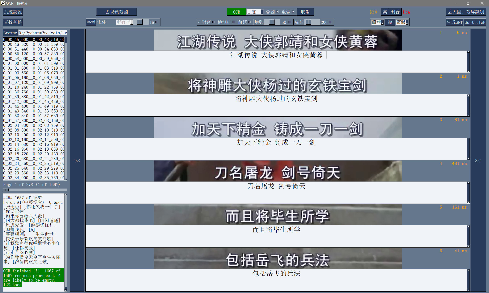
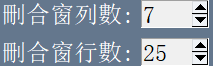
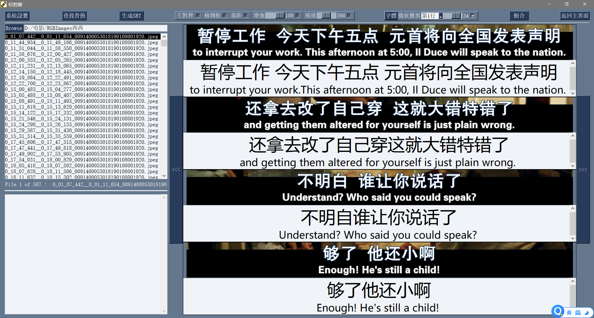
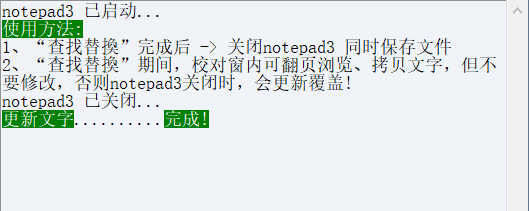
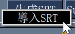

# 硬字幕提取工具10.0 用户使用手册

## 目前为止可行的硬字幕(hardsub)提取方案

这里只说“可行”的方案，那些不成熟的、按时收费的，用过就删的，不在此列。

##### 人工手提，用手和眼来提取时间轴和文字。

> **优点：**
>
> 准确率高（废话）。
>
> **缺点：**
>
> 费时费力，不能常做。

##### esrXP + IdxSubOcr（MODI OCR）

> esrXP提取视频中带字幕的图片（从而也就提取了时间轴信息），打包成idx+sub文件，然后导入IdxSubOcr用微软MODI
> ocr识别文字，生成一个srt字幕文件。

**优点：**

利用传统数字图像处理技术，获得字幕出现和消失的时间点，提取时间轴信息，准确率较高。

**缺点：**

> 老掉牙的微软MODI ocr识别引擎准确率较低，为了照顾MODI
> ocr，esrXP需要做较多设置、试验、调整参数的工作，以便提供漂亮的黑底白字clearTxT给MODI
> ocr,这就很考验用户的经验了。总体来说使用门槛高、识别率较低、工作量较大。虽然esrXP已经停更多时，但是苦于没有更好的选择，长期以来字幕爱好者只能将就着用。

##### VideoSubFinder + ABBYY FineReader

> VideoSubFinde做类似esrXP的工作（不同的是单独保存每个字幕图片，不打包成idx+sub文件），ABBYY
> FineReader
> 15做类似IdxSubOcr的工作，将每个jpg字幕图片ocr识别为一个txt文件，然后回到VideoSubFinder
> 将所有txt文件合成一个srt文件。
>
> **优点：**
>
> 跟esrXP类似，采用了更复杂的数字图像处理技术，提取视频中带字幕的图片和时间轴信息，更好提取算法，上手也更容易。ABBYY
> FineReader 15除了能ocr中英文，还支持其他语种。
>
> **缺点：**
>
> VideoSubFinder仍然基于传统的数字图像处理技术（灰度腐蚀膨胀轮廓色度亮度相似度），虽然能较好提取普通静态字幕（显示固定颜色固定，大多数视频中硬字幕皆属此类），但是对于一些动态字幕（显示变化颜色不定），则难以提取。虽然暴露了很多参数给用户设置，但参数繁多难以理解，普通用户只能用默认设置。
>
> ABBYY FineReader 15离线文字ocr引擎，虽然比MODI
> ocr好得多，但在实际使用效果上，对比近年AI人工智能训练的识别引擎（例如百度OCR通用文字识别引擎），识别准确率还是差了一大截。

##### 硬字幕提取工具10

> 采用AI文字检测+传统的数字图像处理技术，提取字幕图片和时间轴信息（同时也集成了VideoSubFinder给习惯用户），然后利用百度讯飞有道OCR通用文字识别云引擎+离线ocr引擎识别出文字，在校对窗校对后生成srt字幕文件，最后还可选调用第三方工具APP（例如SubtitleEdit）做调轴补漏等工作，从开始到结束，整个字幕提取流程一气呵成，快速准确、识别率高、省时省力。

## 初次使用本软件

总体来说，三个大步骤：

1、将字幕从视频中截图下来

2、将字幕图片OCR为文字

3、校对编辑字幕文件

具体步骤如下所述：

##### 步骤1、准备百度OCR服务APP_ID / API_KEY / SECRET_KEY

到<https://ai.baidu.com/tech/ocr/general>
注册获取百度通用文字识别服务的APP_ID / API_KEY / SECRET_KEY，

一个手机号码注册一个账号（须实名认证）。

每账号每天免费识别次数有规定（依精度不同从每月数百次到2000次不等，每次可识别1张图片，具体政策由厂家规定），如不够用可多注册几个账号，同时厂家经常有优惠活动（例如百度1元购1W次网图识别，讯飞0元购10W次等）。对于长期需求用户，建议充点钱购买次数吧，价格不贵，还能支持国家高科技发展。

注册步骤很简单，可自行百度，获得的APP_ID / API_KEY /
SECRET_KEY信息先保存起来下面会用到。

如果您现在没时间注册，可以下载本工具支持离线OCR识别的版本，使用里面的离线ocr来识别，本步骤可略过。

类似的：

有道OCR到<https://ai.youdao.com/product-ocr-print.s> 注册。

讯飞OCR到<https://www.xfyun.cn/service/textRecg>
注册。（如需要用W模式支持最佳空格识别效果，请选文字识别 --
印刷文字识别（多语种），服务接口认证信息为三项：APPID、APISecret、APIKey）

##### 步骤2、准备工作流程中最后可能用到的APP2第三方软件

到[https://github.com/SubtitleEdit/subtitleedit/releases](https://github.com/SubtitleEdit/subtitleedit/releases%20下载安装Subtitle%20Edit%203.5.18)
下载安装Subtitle Edit 作为 APP2

注：APP2
不指定，可以选用户熟悉的其他软件，例如SubtitleEdit可换成Aegisub或
ArcTime

如果对提取的字幕不需要精调，只是一般使用，本步骤可略过。

如果是离线OCR版须安装包内的vlc-3.0.12-win64.exe，不然智能截图不能工作。

##### 步骤3、设置硬字幕提取工具

打开工具，

点击‘系统设置’

填入步骤1获得的百度OCR服务APP_ID / API_KEY /
SECRET_KEY（如使用离线ocr引擎则不用做此步）

点Browse找到步骤2安装好的APP2的入口exe文件（如不需调轴补漏则不用做此步），然后Save保存设置（APP1已内置VideoSubFinder_5.50_x64不用填写）。

##### 步骤4、用VideoSubFinder_5.50_x64生成RGBImages

点击主界面VideoSubF按键，将启动运行VideoSubFinder_5.50_x64（旁边的‘智能截图’按键是类似于VideoSubFinder的另一个截图工具，采用AI文字检测+传统的数字图像处理技术，善于提取复杂动态字幕并能做到100%不漏，高级用户可学习第四章之-高级功能）

点击左上角**File -\> Open
Video(FFMPEG)（如不能打开视频，可换OPENCV）**，打开要提取字幕的视频文件（本例为：倚天屠龙记之魔教教主-中字.mp4）

快速浏览全片，查看字幕区间矩形最大范围（注意有些视频是两层字幕），用两根竖线两根横线设置字幕截图区间（四根线在视频窗口边缘不容易发现，试着点击选中可以移动它）。**注意：矩形边框要比实际字幕稍大，不要为了节省图片尺寸而把区间设置成紧贴字幕，如果字幕周边余量太小，可能影响后续百度OCR识别（当然也没必要设置得太大）。**

点击Search右边的Settings，出现设置界面，我们只关心左边这块能影响Search字幕图片的参数。

**第一个参数‘Text Alignment’默认设置是‘Center’，须点击设置成‘Any’。**

其他众多参数中，有一个参数至关重要，就是Use Filter
Colors这项，default值是空的，其他参数可以不设，这个一定要设置上，特别是非纯白字幕，例如黄色！如果不设置，有大几率会漏字幕。

**我们需要取色字幕文字的骨干颜色（骨干外则是字幕轮廓颜色，不要取偏了），然后将颜色值填入，将有助于VideoSubFinder判断字幕出现和结束的时间，生成正确的时间轴信息，并防止丢时间轴**。常见字幕颜色可能有白色的、黄色的，或者其他颜色，本例电影的字幕是白色。如果是多色字幕，可以按VSF要求取色多色填入。

具体的参数设置，可以参考Docs目录下的readme_eng.txt，专业用户精调参数可以提高Search字幕帧的准确率，从而减少丢时间轴（少字幕图片，致命）和假时间轴（空字幕图片，影响不大）的情况，不过据笔者使用经验，如果没弄明白参数含义和作用，随意调整反而适得其反，普通用户还不如不调的好。

在右边界面先点一下Pixel Color

然后点击字幕白色文字中心骨干取色，点不准可以多点几下。

取到了颜色，会显示出来

本例将Lab: l:245 a:127 b:129 拷贝后双击填入Use Filter
Coloers，一般做了这步就可以基本保证不会有时间轴丢失的情况，算是完成了Search的设置。

**点击Search -\> Clear Foders 清空RGBImages目录，**

然后点 OCR Search，程序开始扫描视频文件，生成RGBImages。

几分钟后扫描完成，可以关掉VideoSubFinder_5.50_x64，这时工具将显示RGBImages目录下的所有字幕截图：

初次使用我们可以在文件列表区按鼠标右键菜单，选‘Open
folder’打开RGBImages目录看一下：

这些是刚才VideoSubFinder_5.50_x64
Search生成的1000多个字幕切片图片文件，说明这个电影有1000多条字幕呢。文件名前段为时间轴信息。

可以打开文件看看，是RGB**原色**字幕截图切片，很适合**AI**训练过的OCR引擎做识别。

##### 步骤5、清理空字幕图片

我们可以在‘删合窗’中清除RGBImages目录中的空字幕图片。

由于VideoSubFinder
的Search算法还没做到100%准确，所以会误生成少量无字幕空图片（假时间轴），有时还会把广告也截图下来，我们在‘删合窗’中用鼠标滚轮快速翻页浏览RGBImages目录，把发现的空字幕、广告水印图片打上删除标记，标记完最后统一删除，让后续百度OCR识别不用浪费每月有限额度，同时在校对阶段不用再频繁做删除工作。

一页可以显示20~300张图片（默认90张），浏览、标记、删除非常方便。

**翻页**：点击\<\<\<、\>\>\>按键，或键盘PgUp/PgDn键，或将鼠标指针停留在图片区，滚动鼠标滚轮，可以翻页。

**标记**：鼠标左键点击可以标记选中图片，再次点击可以去选中。Shift+鼠标左键可以连续多选、连续去选（可跨页）。

**删除**：直到最后一页标记完成，点击\<\<面板上的‘全删合’按键会弹出删除提示，确认后将删除所有标记过的空图片。

更多方便的功能（例如自动扫描空图、自动合并重复字幕）可以看“第四节之
视频截图、删合窗（删除合并）”

如下图一处为广告，可以选中标记它：

如下图几处为空字幕图片，可以选中标记它：

一直标记到最后一页：

然后点‘全删’，

确认后将会把刚才标记过的所有空字幕、广告水印图片删除掉（如果发现不能删除，多半是系统权限问题，请不要将本工具安装在C盘或桌面）：

清理完空字幕图片后，点击面板上的‘去OCR’按键，将切换到OCR校对窗。

##### 步骤6、运行百度OCR识别

**百度高精度每月免费识别额度较低，如不采用叠图技术 ---
将多张字幕图片合成一张大图来识别以节省额度，每月只能识别较少字幕图片，因此，如果用户没有购买额度，应该在面板上勾选‘叠图’**。

如果没有注册百度，而是采用离线识别引擎可选**tr**并**去掉**勾选叠图。

点击主界面的OCR按键，程序将连接百度OCR服务器，对RGBImages目录中的所有字幕图片从头到尾按顺序做识别，只需等待完成即可。

OCR识别完成了！
（细心的用户可能会留意到：在识别过程中有少量图片会有自动标注‘X’，这是因为程序在OCR识别过程中会自动标注空字幕图片，因为上个手动删空步骤遗留了少量空字幕图片，所以呢，如果你额度充足，是可以不用做手动删空步骤的）

这时在RGBImages目录下已经为每个.jpeg文件生成了一个同名的
.txt字幕文件，以及检测框坐标文件_boundingbox.txt，初次使用可以看一下。

##### 步骤7、校对字幕

如果希望在SubtitleEdit等字幕软件中做校对，可以略过这个步骤，直接到下个步骤

校对窗显示一页1~4列、1~10行（默认1列6行）图文。用户可根据需要在系统设置里设置。

编辑：可以用输入法进行常规的输入、删除、鼠标左键/右键插入空格、回车等操作。

繁简转换：支持中國大陸、臺灣、香港異體字和地區習慣用詞轉換，如「裏」「裡」、「鼠標」「滑鼠」

查找替换：除了支持简单的批量替换，还支持\*
？通配符、反斜杠转义等扩展找替换、正则表达式匹配替换等。

翻页自动保存：点击\<\<\<、\>\>\>按键，或键盘PgUp/PgDn键，或将鼠标指针停留在图片区，滚动鼠标滚轮，都可以进行翻页。翻页将自动保存校对修改过的文字。

选中标记：ctrl+鼠标左键 可以标记**删除**图片，shift+鼠标左键
可以标记**合并**图片，再次点击可以去选中。

删除合并：如果有选中的图片，这时\<\<点‘删合’按键会弹出删除合并提示，OK确认或\<Enter\>将执行删除、合并。

删除合并范围：当前页+前1页=2页内，后向跨页合并是可能的。

校对完成后，按面板上的‘生成SRT’按键，将在RGBImages目录下生成123.srt文件：

可以大概浏览一下，然后关掉。

生成SRT文件后，如时间轴不需要再调整、字幕不需要比对原视频做补漏（要求不高），则至此字幕提取工作**完成**。

更多方便的功能（例如‘精准对齐’，‘鼠标左右键自定义功能’，‘字体选择’，‘字号调整’，‘每行字号单独调整’）可以看“第四节之
校对窗”

生成SRT文件后，如需调整时间轴、比对原视频做补漏，点击面板上的‘SubtitleE’按键，将打开SubtitleEdit工具编辑123.srt字幕文件。

##### 步骤8、用SubtitleEdit编辑字幕文件

之所以前面在校对窗做过校对，这里又用到APP2来做编辑，是因为有些用户（例如字幕组）对字幕要求高，还需要做调轴、补漏等进一步校对工作。

**在波形图窗口里，“点击以添加波形”，**打开视频文件，本例是‘倚天屠龙记之魔教教主-中字.mp4’，将生成波形数据：

在波形图窗口，勾选‘选择当前播放时刻的字幕’，设定播放速度，例如200%，然后开始播放视频，字幕会同步显示在播放窗口，可随时暂停播放，进行字幕校对、补漏、调轴。

该删除的删除，该修正的修正，该替换的替换，改补漏的补漏、该调轴的调轴，注重细节的用户还是认真过一遍吧。

完成字幕校对后，点击“文件-\>另存为”
保存校对好的字幕文件，SubtitleEdit会自动将123.srt重命名为跟视频文件同名的srt文件“倚天屠龙记之魔教教主-中字.srt”，并保存在视频文件所在目录下，方便大多数播放软件播放视频文件时自动加载同名字幕文件。

至此，整个硬字幕提取流程就走完了。

## 硬字幕提取工具10.0 设置

##### 在线OCR服务资源使用

目前支持百度、讯飞、搜狗（已停止服务）、有道四家在线OCR服务厂家，工具需要通过网络连接厂家OCR服务器。

除了在面板上做简单设置外，系统设置中也能设置，绿色Tab选中的服务厂家在保存设置后立即生效。

（选择离线OCR引擎tr、paddle、easy同理，只是可以离线使用，无额度限制）

OCR服务器的识别额度对于用户和程序来说，是有限资源。

**百度OCR：**

如图，百度OCR1~OCR5总共最多5个OCR服务器资源，如果不够用，可以多注册几个账号，长期使用建议购买后付费（OCR服务厂家一般有新注册用户送次数活动，不定期还有优惠折扣活动，可留意）。

每个OCR资源能同时支持4种精度模式：

通用高精A、网图高精W、通用标精G、中文手写H

这4种精度模式从高精到低精轮流使用，也就是说一个OCR资源目前最多能做A+W+G+H次识别（具体额度由百度免费政策规定）。

如果注册了多个OCR例如4个，OCR1 - OCR4，工作时程序将从1 -
4按顺序使用资源，也就是说OCR1当前模式用完了，接着用OCR2的当前模式，OCR1 -
OCR4当前模式都用完了，将自动切换到下一个精度模式，开始第二轮资源使用，A1A2A3A4-W1W2W3W4-G1G2G3G4-H1H2H3H4总共4轮，4轮结束后，信息打印区将打印OCR
All not available !!! Escape...的告警提示信息。

资源使用具体顺序为：

选择**“通用高精A”**：

从OCR1的通用高精开始，OCR1通用高精次数用完，接着用OCR2通用高精，直到OCR4通用高精用完，

将回头开始第二轮，从OCR1的网图高精开始，依次直到OCR4的网图高精用完，

将回头开始第三轮，从OCR1的通用标精开始，依次直到OCR4的通用标精用完，

将回头开始第四轮，从OCR1的中文手写开始，依次直到OCR4的中文手写用完为止。

从上到下，先高精度，后低精度，A1A2A3A4-W1W2W3W4-G1G2G3G4-H1H2H3H总共4轮。

选择**“网图高精W”**：

从OCR1的网图高精开始，直到OCR4的网图高精用完，

将回头开始第二轮，从OCR1的通用标精开始，依次直到OCR4的通用标精用完，

将回头开始第三轮，从OCR1的中文手写开始，依次直到OCR4的中文手写用完为止。

从上到下，先高精度，后低精度，W1W2W3W4-G1G2G3G4-H1H2H3H总共3轮。

选择**“通用标精G”**：

从OCR1的通用标精开始，直到OCR4的通用标精用完，

将回头开始第二轮，从OCR1的中文手写开始，依次直到OCR4的中文手写用完为止。

从上到下，先高精度，后低精度，G1G2G3G4-H1H2H3H总共2轮。

选择**“中文手写H”**：

从OCR1的中文手写开始，直到OCR4的中文手写用完为止。只用低精度，H1H2H3H总共1轮。

目前使用的情况看：

中文识别率：

通用高精 \>= 网图高精 \> 通用标精 = 中文手写

英文识别率：

通用高精 \> 网图高精 \> 通用标精 \> 中文手写

四种精度模式各有特点：

通用高精：支持最多语言识别（前14种），支持自动检测语言，中英文模型综合最佳

网图高精：中文识别效果不错，有时设置比通用高精好，英文有小几率丢失第一个字母

通用标精：支持空格识别，重现字幕中的空格（但是不如讯飞W模型好）

中文手写：支持手写识别

**关于免费额度：**

**‘叠图’技术**大大降低识别次数，能节省额度提高速度，具体实现将多条字幕拼接成一张大图，提交给高精度识别引擎，收到识别结果后再拆分回原来每一条字幕。

如果视频本身清晰度较高，字幕字体较大，工整，可以不用高精度，而用标精度配合本软件的**图像预增强技术**，提高百度OCR识别率（详见第四节之-校对窗
增强魔棒），这为免费用户提供了又一种选择。

**通用高精A、网图高精W识别为单行：**

百度通用高精A、网图高精W如不勾选“（含坐标）”选项时，返回的结果中是没有坐标信息的，这时无法根据返回的信息判断几条相邻的语句是否在同一行上，如果不勾选“识别为单行”选项，则本来是单行的字幕默认可能变为多行，例如下面图例：本来是单行的“少林
武当
峨眉”，因为返回三段语句“少林”、“武当”、“峨眉”，无法判断三段之间的坐标关系而默认为三行。

因此如果**视频中的字幕是单行的**，在使用**百度通用高精A、网图高精W在不勾选“（含坐标）”选项时**，应当**同时勾选“识别为单行”选项，**结果就能保证输出单行字幕。

**智能空格功能**，重现字幕中的空格：

目前除了百度通用高精A、网图高精W可用户设置返回数据是否含坐标，其他所有厂家和模式都默认含坐标，因此都是支持空格识别和重现的，由于百度通用高精A（含位置坐标）、网图高精W（含位置坐标）两种模式的免费额度较少，价格较高，建议非必要不勾选‘含坐标’。

坐标信息的好处：

1.  能识别和重现空格

2.  能显示检测框，从而能快速直观看出是否有漏检测（从而导致漏识别）的情况。

**标点半角全角自动转换：**

由于OCR返回的中文标点多数默认半角，而现实中文标点多是全角，因此程序设计成自动将中文语句中的半角标点替换为全角标点，而英文或数字语句中如果有全角标点，也会自动替换为半角标点。

**标点前后空格自动矫正：**

由于各厂家OCR返回的标点前后可能会误入空格，导致跟图片不一致的情况，程序会针对不同厂家做相应矫正。

**讯飞OCR：**

如需使用空格识别率最高的W模式，注册时选：文字识别 --
印刷文字识别（多语种），服务接口认证信息为三项：APPID、APISecret、APIKey

**有道OCR：**

识别额度不由OCR账号数控制，因此只要注册一个OCR账号就可以了。

**关于OCR服务超时：**

默认设置为‘偶尔’，如果只是偶尔超时，不用调整，

如果经常超时，可设置为‘经常’

通过设置，可以调整底层网络连接OCR服务器的timeout值，以及连接后等待服务器响应的timeout值。

##### 离线OCR服务资源使用（离线OCR版）

目前支持tr、paddel、easy三种离线OCR服务，工具可离线免费使用，无额度限制。

设置界面绿色Tab选中的服务厂家在保存设置后立即生效。

三种离线OCR引擎各有特点，支持的语言、识别率、识别速度各有不同，其中easy
OCR支持GPU加速，有Nvidia显卡的用户如果装有CUDA11.3将能享受加速。

easy OCR在使用叠图功能时，需要勾选‘+
英语’。像tr、paddle这种识别速度很快的引擎，就没必要选叠图了。

zxing条码扫描功能为实验性功能。

##### OCR识别语言类型

设置面板上每种OCR厂家列出了所支持语言类型，最多支持全部18种。

百度OCR 

讯飞OCR 

搜狗OCR 

有道OCR 

Tr OCR 

PaddleOCR 

Easy OCR 

**“中英混合”：**可以正常识别中文字幕、英文字幕、或者中英混合双语字幕，一般情况保持这个默认设置就好了（**这是百度主力模型，识别率比其他语言模型更高**）。

**“自动检测语言”：**支持混合双语、多语语言字幕，能自动检测并分别识别出来。目前百度、讯飞、有道支持此功能。

例如下图这种中日混合的字幕：

**“单一语言”：**如果字幕中只有单一语言，可以选择对应的识别语言。

**“单一语言 +
英语”：**如果字幕中有单一语言和英语混合双语，可以选择对应语言 然后勾选
，目前easy OCR支持此功能。

##### 主题设置，多种主题可选

例如可以选择护眼的暗黑主题：

右上角的喇叭图标，选中将开启工作提示音。

如果选中，生成123.srt同时也会生成123.txt（不含时间轴的纯字幕）

##### 删合窗、校对窗行列数设置

用户可以根据自己屏幕的分辨率、字幕图片长宽比、文字大小，来调整行列组数，有些用户屏幕分辨率较低导致工具窗口超出桌面以外，而有些用户屏幕分辨率较高导致工具界面太小，这时可以调整行列数，以适应屏幕。

删合窗显示一页2~12列、10~25行（默认6列15行）图文。

校对窗显示一页1~4列、1~10行（默认1列6行）图文。

用户可根据需要在系统设置里设置。

例如校对窗设置为2列：

##### 校对窗鼠标左右键 模拟键盘功能设置

充分利用鼠标来模拟1~2个按键组合，从而可以大大提高校对速度。

鼠标右键支持‘插入空格’、‘插入双空格’、‘插入回车’两个功能。默认是‘無’即不开启模拟功能。

鼠标右键支持‘插入空格’、‘插入双空格’、‘插入回车’、‘Backspace按键’、‘Delete按键’、‘字幕菜单’5个功能。默认是‘無’即不开启模拟功能。

例如‘Backspace按键’、‘Delete按键’在OCR返回结果中包含较多无用信息时，可以先用鼠标选中要删除的无用信息，然后按鼠标右键，即可删除之。从而无须去按标准键盘上的‘Backspace按键’、‘Delete按键’。

再例如百度高精度返回识别为单行，如果真是字幕是两行，则可设置为‘插入回车’功能，利用鼠标定位点击的方便性，快速插入回车。

##### 截屏软件设置

 默认设置为F1，大小写兼容。

截图软件如果是snipaste（推荐），保持默认F1就可以了，如果是QQ，可以填入ctrl+alt+actrsd

如果截图软件的启动快捷键变了，在这里重新设置一下

设置好后，点击校对窗界面上的按键打开‘大图识别、截屏识别窗’，

然后点进行截图

##### 键盘和鼠标快捷键列表

点击系统设置中此按键将显示键盘和鼠标快捷键列表，善用快捷键将大大提高工作效率：

## 硬字幕提取工具10.0 高级功能

##### 删合窗

**删合窗相关操作：**

**动画**：勾选则翻页呈现动画效果。如果嫌看得眼花，可随时去勾选。

**黑白**：勾选将图片以黑白显示，对于**固定颜色的字幕**，设置成黑白是个不错的选择。

**前距**：勾选将在每张字幕图片右上角显示前距ms，以及图片id号，前距ms表示此字幕图片的开始时间
距离前一张字幕图片的结束时间为多少ms。显示前距的**快捷键为T**。

例如下图，时间轴间隔分别为：图片7与6之间间隔10ms、8与7之间间隔80ms、9与8之间间隔480ms：

缩放：勾选并设置放大倍数，支持1~2倍文字放大，如果觉得文字太小，可以开启缩放功能。

**合并建议**：设置一个间隔时间ms阈值，凡是\<=这个阈值的前距图片将被建议合并为一条字幕，上图显示共217组。

**阈值设置**：我们还可以通过**ctrl+鼠标滚轮来快速切换合并阈值**，新设阈值会实时生成合并建议。

例如下图，由于设置的合并阈值为10ms，因此图片号1464-1467被建议合并为一条字幕，同时系统设置中‘合并保留’是设置为‘保留最后一张’，

因此‘爱心’符号自动生成在1467图片。

注：合并建议结果作为参考，不保证完全正确，可依葫芦画瓢在棕色建议基础上，手工标记橙色真实标记。

**页拷**：

点击‘页拷’将本页的棕色合并建议，拷贝生成橙色合并真实标记，

例如页拷前显示M：0

页拷后显示M：18，说明本页有18组合并建议生成了合并真实标记。

页拷后可以通过‘**页清’**将本页所有真实标记清除（合并建议不会消失）

**全拷**：

点击‘全拷’将全部页面的棕色合并建议，拷贝生成橙色合并真实标记，

例如页拷前显示M：0

全拷后显示M：217，说明所有页的217组合并建议生成了合并真实标记。

全拷后可以通过**‘全清’**将所有页的真实标记清除（合并建议不会消失）

**单拷**：

快捷键为**ctrl+鼠标左键**，鼠标点击处的棕色合并建议，自动拷贝生成橙色合并真实标记，

例如单拷前显示左边的棕色合并建议，ctrl+鼠标左键点击235~238号任意图片，则自动生成右边的橙色合并标记：

单拷后可以通过**‘单清’**将某个真实合并标记清除，例如ctrl+鼠标左键点击右边235~238号任意图片，则清除橙色合并真实标记，而变成左边棕色合并建议。‘单清’并非只能清除通过单拷生成合并标记，任何橙色合并标记都可以清除。

**合操作/删操作**：点击将切换操作模式，同时左边按键显示在‘删’/‘合’之间切换，**快捷键为空格SPACE
BAR**

注：删合操作可**随时**切换，例如手工标合过程中，发现有需要删除的，可立即切换为删操作，页删后再切换回合操作

**页合**：点击‘页合’确认后将在本页范围内，
执行橙色标记图片的合并，**快捷键为M**

**全合**：点击‘全合’确认后将在所有页， 执行橙色标记图片的合并

**页删**：点击‘页删’确认后将在本页范围内，
执行‘X’标记图片的删除，**快捷键为D**

**全删**：点击‘全删’确认后将在所有页， 执行‘X’标记图片的删除

**页清**：点击‘页清’确认后将在本页范围内，
清除真实标记（‘X’标记与橙色合并标记），**快捷键为C**

**全清**：点击‘全清’确认后将在所有页，
清除真实标记（‘X’标记与橙色合并标记）

**扫描空图**：点击‘扫空图’，将利用离线ocr引擎来做空图扫描，默认tr引擎

右边的D：xx实时显示扫描出得空图数

注：扫描结果作为参考，不保证完全正确，须人工检查确认，不正确的可用鼠标修改‘X’标注

**集删**：例如下面显示扫空图结果有25个图片被自动标记了‘X’，我们点左边的‘集’将这25个标记图片集合到‘集删文件夹’，做统一检查，快速删除真实的空图和废图，这样可以不用翻页检查，提高了效率。

在集删文件夹中检查确认可以删除的图片后，点‘全删’执行删除，然后点‘集’返回原文件夹，可看到刚才删除的图片不见了。

**集合**：例如我们点左边的‘集’，原来文件夹总共有8组棕色合并建议，点
‘集’后8组合并建议将复制到集合文件夹中做统一检查、快速合并，这样可以不用翻页检查，提高了效率。下图是进入集合文件夹中后，我们依葫芦画瓢橙色标记了2组：

点‘全合’执行橙色真实标记的合并，然后点‘集’返回原文件夹，可看到刚才合并掉的图片不见了。

**X标记偏移调整：**

有时候“扫空图”后发现X标记刚好覆盖了一两个字符，不容易辨别是真的空图还是误标记，

我们可以按键盘上的“9 0”也就是“（
）”来快速调整X标记的位置，按“）”将右移标记：

**图片与时间轴同步选中：**

用户有时需要知道所点击的图片对应的时间轴，工具支持图片和文件名同步显示，例如点击图片将高亮显示该图片的文件名（时间轴），反之，点击文件名将高亮显示对应的图片，如下图两处箭头所指：

所有窗口均支持同步高亮显示。

**VSF**：VideoSubFinder俄罗斯优秀的硬字幕图片提取工具（都说彼国破解能力强）

**智能截图**：采用AI文字检测+传统的数字图像处理技术，提取硬字幕图片，解决VSF的两个问题：1、VSF有1000条字幕漏5条的几率
2、VSF对动态字幕（形态变化、颜色变化）无能为力。具体使用看下节‘视频截图窗-智能截图’

删合操作完成，生成了完美的字幕，点‘去OCR’将切换到‘OCR、校对窗’去做ocr识别，识别完可立即开始校对

**删合窗快捷操作：**试着操作几次很快就能熟练，常用的有：

鼠标滚轮前后翻页

CTRL+鼠标滚轮 切换合并建议阈值，并实时生成棕色合并建议

空格切换 删操作/合操作

鼠标左右键标注

CTRL+鼠标左键 单拷/单清

D页删

M页合

C页清

T显示间距

##### 视频截图窗 - 智能截图（须离线OCR版）

为了使用智能截图功能，须使用本工具支持离线ocr的版本，并先安装vlc，双击目录下的**vlc-3.0.12-win64.exe**并安装完成：

双击运行
硬字幕提取工具10.0.exe，点左上角‘智能截图’按键，将打开视频截图窗：

**智能截图相关设置：**

1.  **截图区域**：用四根蓝线框定。提取过程总耗时跟截图面积成正比，因此，截图面积应当在保证检测模型正常工作的前提下尽量小。

例如下图是**正确**的做法，上下留有一定空间给检测模型（只要有文字高度的1/8~1/4就够了）：

而下图是**错误**的做法，将字幕框得太紧了，会导致检测模型工作不稳定，有时会检测不到文字，从而无谓出现一些间隔10ms、20ms的重复字幕图片。

2、**截图间隔**：从16.7ms~2000ms，意思是**期望**每隔多少ms从视频解码中采样一帧。

例如100ms采样间隔意味着**期望**每秒采样10帧，如果是30帧每秒CFR的视频，意味着每3帧保留1帧。

- 采样间隔决定了能保证提取到的最短字幕时长，例如100ms间隔，意味着如果有字幕短于100ms，将有机会完全提取不到（当然一般字幕长度都超过500ms，200ms的字幕人眼观看是无意义的），因此，间隔的选择主要由最短字幕时长决定，极端情况下如果字幕最短时长为200ms，那么选择间隔为100ms是合理的，因为这能保证在200ms内采样到2帧，2帧合并后的字幕时长为200ms。

- 采样间隔决定了提取的时间轴的精度，例如100ms间隔，意味着可能的最大误差为99ms，也就是最终提取的一条字幕，最不幸前面丢失99ms，后面丢失99ms。

- 采样间隔与总耗时成反比，例如50ms间隔将比100ms间隔多采样一倍图片，提高时间轴精度的同时，总体时长将增加一倍，多数时候是不划算的、没必要的。

- 设置的**期望**间隔 与 程序运行时的**实际**采样间隔
  有时**不一定相等**，看下面两个例子：

**例1：**

下图所示的视频平均帧率fps=29.97，平均每帧1000ms/29.97=33ms，而我们设置的100ms间隔是**期望**间隔，

3帧刚好100ms，因此**真实**采样间隔是100ms，也就是每3帧采样1帧。

**例2：**

下图所示的视频平均帧率fps=24.561，平均每帧1000ms/24.561=40ms，而我们设置的100ms间隔是**期望**间隔，

3帧120ms\>100ms\>2帧80ms，程序取最接近的大值，因此**真实**采样间隔是120ms，也就是每3帧采样1帧。

如果我们设置的67ms**期望**间隔，2帧80ms\>67ms\>1帧40ms，程序取最接近的大值，因此**真实**采样间隔是80ms，也就是每2帧采样1帧。

3、**扫描引擎**：目前支持paddle、easy、tr三个。

在系统设置中，和在视频截图窗中，都可以设置，效果是一样的。

- paddle只用CPU，速度快，检测准确，是默认引擎。如果有Nvidia显卡和CUDA11.3支持，可以选easy引擎，并在系统设置中勾选‘使用GPU’
  会自动加速，加速后总体速度比paddle稍慢。

- paddle和easy引擎需要设置对应的语言，例如中英文，简体还是繁体。对结果有较大影响，请正确设置。

- paddle目前的模型中英文简繁体支持很好，其他语种未测试，应该不如中英文。easy对多语言支持更好。

- tr只支持中英文，但是对其他语言也有不错的检测能力。tr是三个引擎中速度最慢的。

4、**截图过程中自动合并**：

默认使能，勾选后在智能截图过程中自动合并0ms间距图片，而不会把图片保存到硬盘。

5、**合并保留设置**：一组0ms间隔图片中的哪一张，将被自动标记为爱心。

默认是保留最后一张，一般的彩虹字幕选这个。

如果是渐显-\>渐消
类型的字幕，可以设置为中间一张（1/2處），具体情况具体分析。

下面通过几个案例，演示硬字幕提取过程：

##### 固定字幕（普通字幕）：

觉得多数硬字幕属于此类：形态固定、颜色固定。

鼠标点击黑色背景，打开浏览器选视频文件，本例为：倚天屠龙记之魔教教主-中字.mp4

我们看到视频文件是可变帧率VFR。

拖动进度条浏览字幕显示区域，用两竖线两横线框定它：

截图间隔默认为100ms，扫描引擎默认为paddle，如果有Nvidia显卡和CUDA11.3支持，可以选easy引擎：

如需观看截图过程的字幕图片，可勾选‘显示’，字幕图片将抽样显示，会增加处理时间15%左右，一般不必打开。

设置完成后点**‘开始’**运行智能截图，只需等待完成即可。

作者的机器AMD
5900HX的笔记本，2小时的720p视频提取约需10分钟，2小时的1080p视频提取约需18分钟。

我们可以看到，实际的截图间隔是120ms，这是因为视频平均每帧1000ms/24.561=40ms，而我们设置的100ms**期望**间隔，3帧120ms\>100ms\>2帧80ms，程序取最接近的大值，因此真实采样间隔是120ms，每3帧采样1帧。

并且因为视频是可变帧率VFR，因此实际采样间隔可能还会随时间有微小变化。

智能截图完成后，关掉视频截图窗， 删合窗将显示截取的字幕图片：

我们在删合窗看到所有截取的图片，图片比较长条，可在系统设置将删合窗行数设置为25，以方便查看：

并最大化窗口，以方便操作。

好，现在开始删合操作，SPACE空格先切换为‘删操作’：

对于广告废图（一般在片头**Home**、片尾**End**），须手工标注（鼠标左键、Shift+鼠标左键），例如下图中片头和片尾的几张废图：

然后设置扫描空图引擎为tr，点‘扫空图’开始扫描：

很快扫描完成，可能的空图由机器自动标记了‘X’（不一定完全准确），叠加刚才片头片尾手工标注的‘X’，可以看到现在总共有38个空废图：

然后点‘集’做空废图集中删除操作，而不用慢慢翻页查找，

所有‘X’标注图片集中在‘集删文件夹’，方便检查和删除操作。

检查无误后，点‘全删’删除之，如果有误标注的可鼠标点击图片去掉‘X’标记，‘全删’时则不会删除。

删除完成后，点‘集’返回原文件夹，

点‘删操作’或SPACE空格按键，切换为‘合操作’

Ctrl+鼠标滚轮设置合并建议间隔为10ms，则间隔为10ms内的的图片将自动生成棕色合并建议。我们检查这些棕色建议中哪些是需要真正合并的。

为什么是10ms呢，因为10ms是智能截图间隔100ms的1/10，两条不同字幕间，会用10ms间隔开来，差异很大的字幕则会用20ms间隔开来，在程序还做不到100%准确辨别之前，只能用肉眼做辅助检查，做人工标注。

同理，如果智能截图时间隔设置为200ms，我们应该先设置合并建议间隔为200ms的1/10=20ms，检查完一遍后，设置合并建议间隔为40ms再检查一遍。

同理，如果智能截图时间隔设置为67ms，我们应该先设置合并建议间隔为67ms的1/10=6ms，检查完一遍后，设置合并建议间隔为12ms再检查一遍。

用键盘‘**\<
\>**’键或者鼠标滚轮翻页浏览，我们发现其中有小部分是正确的建议，例如：

或者不完全正确，但是可参考：

但所有合并建议都值得人眼过目一遍，以便决定是否做人工标记动作。

其中图片左边的**竖线**代表**合并标记**，**横线**代表不同字幕之间的**间隔标记**，保留标记**红心**代表合并后**保留**的图片。

鼠标可在图片上直接操做标记：鼠标左键放置/清除**合并标记**，鼠标右键放置/清除**间隔标记**，鼠标左键双击放置/清除**保留标记**。

因为系统设置中已经设置**合并保留最后一张**，因此红色爱心**自动**生成在放置间隔标记的图片上，一般只用鼠标左右键就能轻松完成手工标记。用户可多操作体验一下，很快就能学会并高效操作。

我们用鼠标左右键依葫芦画瓢，在棕色合并建议基础上，手工标注真实的橙色合并标记（也可以**CTRL+鼠标左键**单拷）：

用键盘‘**\<
\>**’键翻页，一直标注到最后一页，一般需要手工标记的合并很少（本例10ms和20ms设置下只有2个），如果需要合并的组不多，不想在删合窗做合并，也可以在校对过程中合并。

然后点‘全合’做合并，很快合并完成，也可以边浏览边‘页合’：

最后检查一遍，如果发现有废图漏删除的，可再用手工标记并删掉。另外标记过程中支持**边删边合**，看到哪个地方不爽需要立刻做删合的，可随时解决，**‘页删D’、‘页合M’**
这些按键只作用于当前页，可**SPACE空格**随时切换删除、合并操作，不会改动在其他页做过的任何标记。

至此删合工作完成，可以去进行OCR识别了：

看到上面的过程，也不必觉得繁琐，做两次就能熟练了。无非就是鼠标滚轮、鼠标左右键、空格、D、M。

##### 动态字幕（彩虹字幕）：

鼠标点击黑色背景，打开浏览器选视频文件，本例为：410ch.mp4，特点是字幕从一点到完整逐渐展开显示，类似kalaok字幕的动态效果，且每条字幕颜色变化不定，要准确提取，需要AI和算法支持。

拖动进度条浏览字幕显示区间，用两竖线两横线框定它。

截图间隔默认为100ms，扫描引擎默认为paddle，如果有Nvidia显卡和CUDA11.3支持，可以选easy引擎：

设置完成后点**‘开始’**运行智能截图，只需等待完成即可。

我们可以看到这个恒定帧率CRF的视频fps=29.97,设置为100ms采样间隔，实际间隔为100~101ms恒定，很符合。

智能截图完成后，关掉视频截图窗，返回删合窗，

我们在删合窗看到所有截取的图片，图片比较长条，可在系统设置将删合窗行数设置为25，以方便查看：

并最大化窗口，以方便操作。

Ctrl+鼠标滚轮设置合并建议间隔为10ms，

我们用鼠标滚轮翻页浏览一下，

我们发现10ms间隔下有大部分合并建议是正确的，多数都是前面半个字的情况，总共51组需要合并：

点‘集’进行第一轮10ms间隔的51组合并建议进行集中合并：

点‘全拷’后，检查合并标记，如果有误标注的用鼠标左右键修正之，确认无误后点‘全合’进行合并。

合并完成后点‘集’返回原目录。

Ctrl+鼠标滚轮设置合并建议间隔为20ms，

我们发现20ms间隔下有小部分合并建议是正确的，总共有48组建议合并：

点‘集’进行第二轮20ms间隔的48组合并建议进行集中合并：

鼠标左右键、ctrl+鼠标左键，标记好橙色真实合并标记后，点‘全合’执行合并，

如果发现里面也有需要删除的图片，也可在集合文件夹中删除之，

集合文件夹中的合并删除操作没有任何限制，可随时做删合操作。

完成后点‘集’返回原目录。

设置扫描空图引擎为tr，点‘扫空图’开始扫描：

扫描完成，我们看到提示有39个空图，然后点‘集’做空废图集中删除操作，而不用慢慢翻页查找，

我们发现彩虹字幕中有两类容易误标注，须手工修改：

- 半个、一个字

- 颜色很浅（以至肉眼都难以看清）

如果发现误标注占多数，可以先‘全清’后再手工标注‘X’。

标注完检查无误后，点‘全删’删除之，

删除完成后，点‘集’返回原文件夹，

最后再讲合并建议阈值设置为0ms，在干净的页面浏览一遍，看看有没有漏网之鱼，有需要删除或合并的可随时操作。

至此删合工作完成，总共提取了1191条字幕，可以去进行OCR识别了：

看到上面的过程，也不必觉得繁琐，做两次就能熟练了。无非就是鼠标滚轮、左右键、空格、D、M。

另：如果在SubtitleEdit中校对时间轴时，发现字幕有**偏短、后移**的问题，可以在SubtitleEdit中调整，全选字幕—鼠标右键菜单—所选行—调整所选行时长（**增加时长**）、提前/推后显示所选行（**提前显示**）：

##### 复杂字幕（场景字幕）：

复杂字幕的特点是：截图面积大，背景（场景）复杂，动态变化大，场景中有各种文字和颜色干扰，要准确提取，需要AI和算法支持，以及便利的删合工具。

鼠标点击黑色背景，打开浏览器选视频文件，本例为：12_video.mp4，

拖动进度条浏览字幕显示区间，用两竖线两横线框定它：

截图间隔默认为100ms，扫描引擎默认为paddle，如果有Nvidia显卡和CUDA11.3支持，可以选easy引擎：

设置好后点‘开始’

截图面积比较大，所以时间相应增加了。

智能截图完成后，关掉视频截图窗，返回删合窗。

我们在删合窗看到所有截取的图片，图片比较大，可在系统设置将删合窗设置6行10列，以方便查看：

并最大化窗口，以方便操作。

好，现在开始删合操作，先点中间橙色/红色键（或按**SPACE**空格），设置为‘删操作’：

然后设置扫描空图引擎为tr，然后点‘扫空图’开始扫描：

很快完成，机器自动标记了共78个‘X’：

由于这部美剧频繁插入片间广告，而框定的场景中很多文字都会被识别到，因此有很多废图都保留了下来。

然后点‘集’做空图集中删除操作，而不用慢慢翻页查找，

所有‘X’标注图片集中在‘集删文件夹’，方便检查和删除操作。

检查无误后，点‘全删’删除之，如果有误标注的可鼠标点击图片去掉‘X’标记，‘全删’时则不会删除。

删除完成后，点‘集’返回原文件夹，

由于这部美剧频繁插入片间广告，我们不用**集删集合**，而采取翻页浏览**边删边合**的做法。

点中间橙色/红色键（或按**SPACE**空格）切换为‘合操作’

Ctrl+鼠标滚轮增加合并建议阈值为10ms发现合并建议为0组，

然后增加合并建议阈值为20ms，将生成棕色合并建议：

我们发现其中有部分是正确的建议，例如：

或者不完全正确，但是可参考：

但所有合并建议都值得人眼观察一下，以便决定人工标记动作。

其中图片左边的**竖线**代表**合并标记**，**横线**代表不同字幕之间的**间隔标记**，保留标记**红心**代表合并后**保留**的图片。

鼠标可在图片上直接操作标记：鼠标左键放置/清除**合并标记**，鼠标右键放置/清除**间隔标记**，鼠标左键双击放置/清除**保留标记**。

因为系统设置中已经设置**合并保留最后一张**，因此红心**自动**生成在放置间隔标记的图片上，一般只用**鼠标左右键**就能轻松完成手工标记。用户可多操作体验一下，很快就能学会。

我们可以Ctrl+鼠标左键单拷，或依葫芦画瓢做标注。

鼠标滚轮（或者\<
\>键盘）边翻页边标注，一直标注到最后一页。一般越复杂的字幕（场景混杂）需要手工标记的合并越多。

标记完后点‘全合’做合并，等待合并完成：

标记过程中是支持**边删边合**的，看到哪个地方不爽需要立刻做删合的，可随时解决，**‘页删D’、‘页合M’**
这些按键只作用于当前页，可**空格键**随时切换删除/合并操作，不会改动在其他页做过的标记。

可以检查几趟，把需要合并删除的都不放过，直至满意为止。

至此删合工作完成，可以去进行OCR识别了。

看到上面的过程，也不必觉得繁琐，做两次就能熟练了。无非就是鼠标滚轮、鼠标左右键、空格、D、M。

其实我们最不希望遇到的是漏字幕，‘智能截图’的工作原理决定了，只要认真一点，漏字幕的情况就不会出现。

##### 校对窗

点击主界面上的‘去OCR’按键，将打开‘OCR、校对窗’。

校对窗专门用于OCR批量识别完成后的字幕校对，校对窗支持以下功能：

**图文精准对齐：**

subtitleEdit、Aegisub、ArcTime等字幕软件不具备图文对齐校对的功能，为提高校对效率，做了这个校对窗。

通过三大魔棒：**缩放对齐魔棒、字体魔棒、增强魔棒**，实现图片和文字的“精准对齐”功能，让费眼费时的缺漏校对工作变得高效轻松。

**缩放对齐魔棒：**

对齐前：（刚开始打开校对窗，图片文字跟文本框文字大小宽度一般来说是不一致的，**一眼看去**，不知哪里有缺漏）：

为了能**一眼看出**是否有漏字、少空格、少标点等，需要图片和文本框中文字的精准对齐，因此需要支持图片的**缩放**和**自由平移**。勾选使能
‘缩放对齐魔棒’，可对图片做0.5~5倍的缩放，**同时还可以用鼠标左键（按下不放）拖曳图片自由移动，缩放**和**移动**两者来回做几次最终可以实现**精准对齐**。

对齐后就可以开始校对工作了。在文本框中做文字输入删除，插入空格等。

对齐后：（图片文字跟文本框文字大小宽度完全一致，**一眼**就能看出哪里有缺漏，马上就能定位加空格
– 可在系统设置中设置鼠标左右键加空格）：

**字体魔棒：**

有时候文本框的默认字号显得有些小，或者字体跟原字幕不同，这时可以调整字号、字体，直到大小和形状跟原字幕尽量接近。

例如6组图文框下：

例如双层字幕，且每层字号不同的情况下：

这时发现原字幕好像是微软雅黑，而当前字体为宋体，点击更改设置为‘微软雅黑’：

确定后变为微软雅黑：

**增强魔棒：**

有时候在校对过程中发现前面OCR识别结果不理想，又懒得手动修改，想针对某些个图片重新做OCR识别，这时可开启增强魔棒，调整对比度（还可系统设置里更换OCR厂家），然后双击图片做单图识别，或者鼠标右键菜单选OCR厂家做单图识别。

通过调整增强魔棒的值（例如百度paddle在对比度为15%时有时会明显提高识别率和精度），

更换不同OCR厂家，也可以得到比较理想的识别结果。

同时，增强魔棒还能作为‘护眼魔棒’来使用，黑白化对眼睛更友好。

“护眼魔棒” + 暗灰主题，关爱费眼的校对工作：

**左对齐、检测框、前距：**

系统默认是居中对齐，但是有个别视频的字幕是左对齐的，为了方便校对，可勾选‘左对齐’（下图是临时做的例子）

显示检测框（百度高精度、网图如不勾选‘含坐标’，则不会显示检测框）：

显示前距，距离上一图片字幕时间轴间隔（用于帮助判断是否可以合并，下面介绍）：

**补漏删合：**

删合窗中进行了删除合并操作，或者OCR完成后，仍然发现有漏网之鱼怎么办？

其实在校对过程中，也可以进行删合操作。

图片**删除**标记：**ctrl+鼠标左键**
点击图片可以标记‘X’，再次点击可以去选中。

图片**合并**标记：**ctrl+shift+鼠标左键**
点击图片可以标记‘\|’，再次点击可以去选中。

D:0表示目前有0个图片被标记了‘X’，M:0表示目前有0组图片被标记了橙色合并标记‘\|’。

如果D或M\>0，点“删合”将在本页+上一页=2页内执行，支持跨页合并。

如在两页内有删合标记的图片，这时点‘删合’按钮会弹出删合提示，按回车\<Enter\>确认后将执行删除、合并。后昆仑决看就看的《》\<,.,kl如果同时有删除标记和合并标记，将按先合后删的顺序执行。

同时，校对窗也支持类似删合窗中的**“集删”**功能，如果D\>0，点“集”将所有页中标记了‘X’的图片和文字（如果存在）都集中到集删文件夹做集中删除操作，一般在OCR完成后发现有‘X’，又不想边校对边删除的，可以集中删除处理。

校对窗中的删合功能比删合窗简化，主要用于在校对过程中随校随删合，不必切换回删合窗中去做。

例如下图例中（演示目的，实际不需要删合），

第二个图片用ctrl+鼠标左键
标注红‘X’，第三第四个图片用ctrl+shift+鼠标左键标注橙‘\|’，

然后点“删合”，确认后将删除第二个图片，第三第四个图片将合并为当前第四个图片

（系统设置中合并保留默认为‘最后一张’，所以是第四个图片，用户可根据需要自行调整）。

删合前：

删合后：

**校对功能：**

**文本框切换：**

**Ctrl+↑/↓快捷键**可以在文本框间切换，若当前光标在页末则自动翻页。

**图片和时间轴同步显示：**

**鼠标双击单独识别图片：**

如在校对过程中，发现某条字幕识别结果错误太多，不想手动改正，可双击图片重新单独做OCR，

也可在图片上鼠标右键弹出ocr菜单，选不同的ocr引擎重新做识别

**繁简转换：**

支持中國大陸、臺灣、香港異體字和地區習慣用詞轉換，如「裏」「裡」、「鼠標」「滑鼠」。

OCR完成后，如上图设置为对所有文字做 繁体-＞简体
的转换，然后点‘转’，很快就能完成所有文字的繁简转换。

同时如果开启了鼠标右键字幕菜单，也可以对选中的文字做繁简转换：

**编辑查找替换：**

点击‘查找替换’将打开工具自带的Notepad3并定位到当前行，
**ctrl+F**为对应快捷键。

点击替换按键将弹出查找替换窗口：

一般情况用普通模式，通配符\*
?和正则表达式则是更高级的功能，可自行学习，学会了很强大！

可以边浏览校对窗，边在Notepad3中做查找替换，如果想看到替换后的效果，可以关闭Notepad3并保存修改过的文件，修改过的文字将自动更新到校对窗中显示出来。

上述动作可反复做多次，直到校对完成。

**插入SRT/ASS文件斜体、粗体、下划线、字幕显示位置设置：**

在鼠标右键模拟键盘设置为‘無’时，即不开启模拟功能时，校对窗的文本框可以用鼠标右键菜单做简单编辑:

例如为了将人名“郭靖”设置为播放器播放时为斜体，可以先选中“郭靖”然后鼠标右键弹出菜单选‘Add
\<i\>\</i\>’，

“郭靖”将变成“\<i\>郭靖\</i\>”，播放器播放时将变成“*郭靖*”

**生成SRT：**

校对完成后，点‘生成SRT’将立即生成123.srt字幕文件。

**导入SRT：**

在‘生成SRT’按键上还提供了鼠标右键菜单，可导入第三方APP修改过的SRT文件**。**

有些用户希望生成SRT后，在第三方APP2中做一些繁简转换、中英翻译、方言变换、批量替换、调时间轴等工作，做完后再导入校对窗，利用校对窗方便的图文对齐、删除合并功能，进一步校对优化，这时可利用‘导入SRT’功能。

需要注意的是：导入的SRT文件里的字幕条数不能减少，必须和原图片数一致，否则会导致图文错位。

同时，‘导入SRT’功能，还有利于字幕提取的分工协作。

##### 大图、截屏窗（大图、截屏、拍照识别）

截图识别功能首先要安装snipaste（推荐）或者QQ等截图软件，

在系统设置中设置好对应的截图软件启动快捷键（见第三节之7.截图软件快捷键设置）。

然后浏览网页（收费内容），或者翻看pdf文件、翻拍老书等。

需要截图识别时，点击主界面上的‘大图、截图识别’按键，将开启截图窗。

点击‘開始截圖’按键将启动截图软件进行截图，中途可以按ESC\<\>\<ESC\>键退出，截图完成后，将自动连接OCR服务器识别并显示识别结果。截得的图片保存到工具软件目录下的capture子目录中。

**排版重现：**

当系统设置里选用带返回坐标的OCR引擎时，识别结果将支持**缩进、行距、词距、空格**适配，重现排版。

**缩进与行距调整：**

可由用户自行设置缩进与行距，让识别结果不需再排版就能使用。

调整缩进和行距后，点‘打开TXT’可看到实际结果：

**进一步编辑：**

点‘复制全部’，可将文本框中的文字全部拷贝到剪贴板。

点‘打开TX’，将调用notepad打开txt文件。

于是可以到office中进一步做编辑工作。

**大图识别：**

可以Browse打开大图文件目录，对图片做OCR识别，相当于主界面的大图版（主界面适合字幕图片、窄图片）。

目前支持 ".png", ".gif", ".jpg", "jpeg", ".tiff", ".tif", ".bmp"格式。

鼠标双击图片可做**单图识别**

点OCR可对该目录做**批量识别**，与主界面无异，只是**不支持叠图**，同时却能**支持排版重现**。

增强魔棒、缩放魔棒同样功效。

**显示检测框，鼠标点击检测框，则框内内容将复制到剪贴板：**

**拍照识别：**

有时候需要拍照实物做识别，从10.0版开始支持PC内置摄像头、外界USB摄像头拍照识别。

设置好相机和像素后，点‘开始拍照’将开启摄像头，对焦清晰后点‘确认’将保存相片，并自动做OCR识别。与截图识别类似。

在文字‘相机’或‘像素’上鼠标右键将弹出‘Refresh
camera’菜单，点击将刷新PC所有的摄像头信息。

##### SUP/IDX+SUB 图形字幕OCR

最近了解到SubtitleEdit 3.6.5
及后续版本可以导出兼容VideoSubFinder的时间码，因此可以利用本工具的OCR和校对功能，快速提取图形字幕生成SRT文件。

步骤如下：

1.  用SubtitleEdit 3.6.5打开sup字幕文件：

>  style="width:6.65211in;height:3.78002in" />

2.  导出带有时间码的图像到一个新建目录中例如‘D:\电影\test’，然后关掉SubtitleEdit：

>  style="width:6.7013in;height:3.98006in" />
>
>  style="width:6.70437in;height:3.80972in" />
>
> 打开所在文件夹看一下，发现图片中没有异常分辨率的广告之类（如果有超大尺寸的图片，多数是广告，删掉）：
>
>  style="width:6.7106in;height:4.42618in" />

3.  到硬字幕提取工具OCR校对窗中点Browse到目录‘D:\电影\test’，将显示刚才提取的字幕图片：

>  style="width:6.84096in;height:4.54627in" />

4.  主界面点‘OCR’将开始OCR，这时会提示将所有图片转化为同一尺寸，

>  style="width:5.12609in;height:0.78152in" />

确认后开始归一化，归一化完成后将开始叠图OCR，与平时的叠图OCR一样，等待完成后，点‘生成SRT’即可：

注意事项：

1.  对于特效字幕，OCR前可以先到删合窗中，从特效开始到结束‘合并’为一条长时间字幕。

2.  Sup提取的图片中如果有全屏广告字幕，应当先用图片裁剪工具将无用内容裁剪，保留有用内容，否则会因为图片太高（\>512px）而不能成功归一化。

## 问题反馈

Q&A:

1、

Q: 软件需要安装吗？运行出错怎么办？

A:
绿色免安装，解压即可。如果32bit版本（6.7版及旧版支持32bit、64bit，从7.0版开始将不再更新32bit）运行出现“Failed
to execute script
pyi_rth_multiprocessing”错误，说明win7x32系统太旧，要先装
KB2533623才行。如果出现找不到dll的报错，请安装Microsoft .NET Framework
4.8和Microsoft Visual C++
2015-2019。如果运行过程中，执行命令或删除出错，多半是系统权限问题，请不要将VSF及工具软件解压安装在C盘、或者偷懒放到桌面运行，有这种坏习惯要改。

2、

Q: APP2指定须要用文档例子中的第三方软件吗？

A:
不指定，甚至可以不用设置，本工具将第三方软件集成入工作流中，减少了各个APP来回切换的时间。

3、

Q: 可以自动标注空字幕图片吗，人眼找空字幕费眼神？

A：离线版的删合窗有‘扫描空图’功能，可以自动标注‘X’，另外在OCR过程中凡是识别为空的字幕图片，都会自动标记‘X’，不需要用人眼来寻找空字幕.

4、

Q: OCR服务商免费吗？

A:
每家OCR服务商提供不同的免费识别额度（每天每月有一定数量，具体看厂家规定），业余人士可利用免费额度。同时厂家经常有优惠活动（例如百度1元购1W次网图，讯飞0元购10W次，有道新注册送100元等）。而对于长期需求用户，建议充点钱购买次数吧，价格不贵，还能支持国家高科技发展。

从7.0版本开始，离线OCR版本提供了tr、paddel、easy离线OCR引擎，不需要任何KEY，可离线使用，完全免费。

5、

Q: 为什么填写了OCR服务商的KEY后，不能识别？

A: 请确认开通了服务商的文字识别服务，如识别出现“Network
Exception!”错误提示，说明无法连接到OCR厂家的服务器，请检查网络连接是否正常（不要用VPN代理），或重启一下电脑再试。

6、

Q: 高精度和低精度识别率差别大吗？

A:
对于清晰简单的字幕，差别不大，模糊复杂（多种语言混合）的字幕、大图识别，差别较大，在批量识别前可做识别试验，以便选择最佳设置。

7、

Q: 有时候叠图出现‘间隔标记丢失，尝试纠正！’的告警提示，怎么办？

A:
OCR厂商训练的机器学习模型，对不同特征的图片识别能力不同，甚至有些特殊爱好或怪癖，例如百度OCR对于模糊字幕的叠图容易丢失间隔标记（模糊与清晰并存时眼睛有点花），其他厂家的OCR则没有这种问题。有些语言类型设置会丢失第一个英文字符，有些会丢失标点，小问题不一而足。每种机器学习模型的情况都不同，在批量识别前可先做识别试验（包括加入增强魔棒），以便获得最佳设置，得到最佳识别结果。

8、

Q: 极速叠图会导致识别率降低吗？

A:
对于清晰简单的字幕，识别率只有轻微降低，几乎没有影响。模糊复杂（多种语言混合）的字幕，降低较明显，如果出现识别率明显降低，或者出现‘间隔行丢失，尝试纠正...
如经常出现，请改用半叠或不叠’的告警提示，可中止识别，改为半叠或者不用叠图。叠图的主要好处是节省额度、节省时间。

9、

Q: 想快速切换浏览图片，怎样操作最快速、方便？

A:
请用鼠标滚轮来做图片切换浏览，滚动时请将鼠标指针停留在图片区中，然后滚动滚轮，养成使用习惯后会很方便。

10、

Q: 批量识别过程中出现Network
Exception错误、额度用完、手动中止，导致识别未完成，又不想重头识别，想从中断点处继续识别怎么操作？

A: 主界面‘重做’去勾选，接下来再做批量识别将自动从中断点处继续识别。

11、

Q: 识别率不高、漏字、错字、漏标点、漏空格，怎么办？

A: 识别率主要由OCR厂家训练的机器学习模型决定，遇到识别率问题，可以：

1） VSF、智能截图的截图框尽量接近字幕文字，让图片中的文字尽量显大

2） 更换OCR厂家

3） 更改语言类型设置

4） 利用‘增强魔棒’提高识别率

5） 如果用了叠图，可以改为半叠或者不叠

6） 识别完成后，利用校对窗、SubtitleEdi、Aegisub等字幕软件替换错误字符

12、

Q:
百度高精度识别率挺高的，多数情况下只需要补上识别丢失的空格，就能完成文字校对工作了。有办法提高插入空格速度吗？

A:
7.0版开始支持“鼠标左键或右键一键插入空格”只需要按一下鼠标就能插入一个空格，补漏空格变得更轻松了。

13、

Q: OCR批量识别完成后，是在校对窗中校对，还是在APP2第三方字幕软件中校对？

A: 看个人喜爱，校对窗提供了精准对齐功能，可以大大提高校对速度。

14、

Q: 网页截图识别没反应？如何提高网页、pdf文件截图识别率？

A:
需要先安装第三方截图软件如Snipaste或QQ截图，然后配合本工具才能实现截图识别。为了提高识别率，可以选用高识别率OCR厂家、还可开启增强魔棒，推荐使用Snipaste截图软件并将输出图像质量设置成100。

15、

Q: 想用离线OCR识别？

A:
7.0版本开始内置支持离线OCR（须安装支持离线OCR的版本，体积较大）。也可以用ABBYY，文末VSF +
SubtitleEdit （64bit）下载，内有VSF中文使用手册，有个简单步骤可以参考。

16、

Q: 检测框有什么作用？

A:
OCR通常包含两个步骤‘检测’+‘识别’，也就是先用检测算法扫描图片，确定哪些位置有文字以做后续识别，这些位置是用检测框的长方形坐标表示的，因此很容易通过显示检测框来判断检测算法是否可靠，例如是否框对了位置？是否漏框了？只要OCR服务返回的数据中包含坐标信息，都可以显示检测框，支持随时开启和关闭显示。

17、

Q: 能支持sup、idx+sub图片字幕吗？

A:
用户给出了简单的方法：把sup或idx+sub丟進SubtitleEdit，在OCR文字區按右鍵\>匯出，選擇最後一項的「圖像名稱以時間碼儲存」，選擇輸出（dumy.png）到文件夾，硬字幕提取工具就能以正常時間碼生成SRT。同时喜欢用
esrXP生成idx+sub的用户也可以试试这种方法，具体可参考手册第四节之
SUP/IDX+SUB 图形字幕OCR。

18、

Q: 智能截图速度能再快些吗？

A: 将持续优化。

19、

Q: 使用时遇到报毒？担心程序植入了木马？

A:
请不用担心，因为本工具是python打包，很多防毒软件会误报（除非购买白名单证书或申请鉴定）。如不信，你可以不用，如果要抬杠，可以找人破解本工具代码，给出真实证据。

**免责声明：**

本免费工具仅供个人使用，为业余提取字幕的朋友提供方便，不可用于商业目的，不可侵犯他人知识产权。

同时，本工具利用了OCR服务商的免费额度，作者建议有长期大量需求的用户，请购买OCR服务商的额度，支持国家高科技发展。

长期更新下载地址：

<https://www.zhihu.com/people/huang-yao-shi-91-46/posts>

<https://bbs.acgrip.com/thread-7385-1-1.html>

如果您在使用软件过程中遇到问题，可以到上述地址反馈，

技术合作或问题反馈，也可以发邮件到 <726947858@qq.com>，期待您的反馈。
